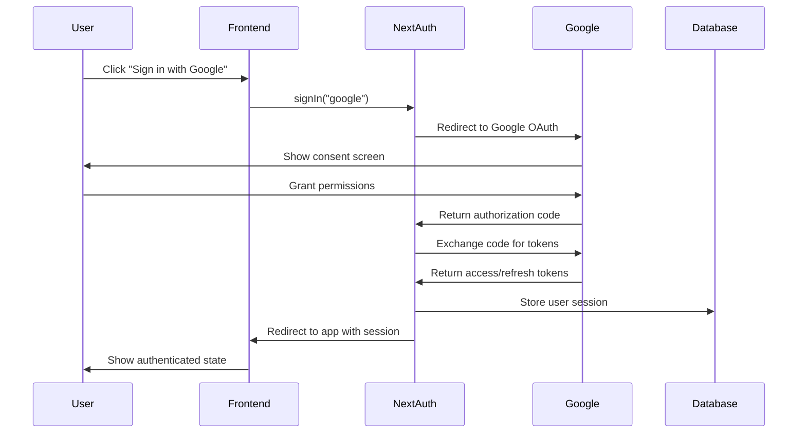
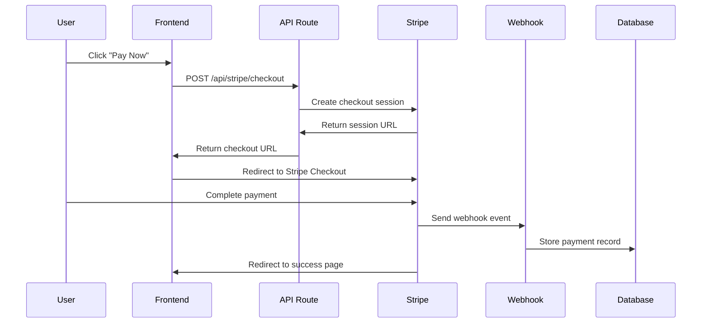
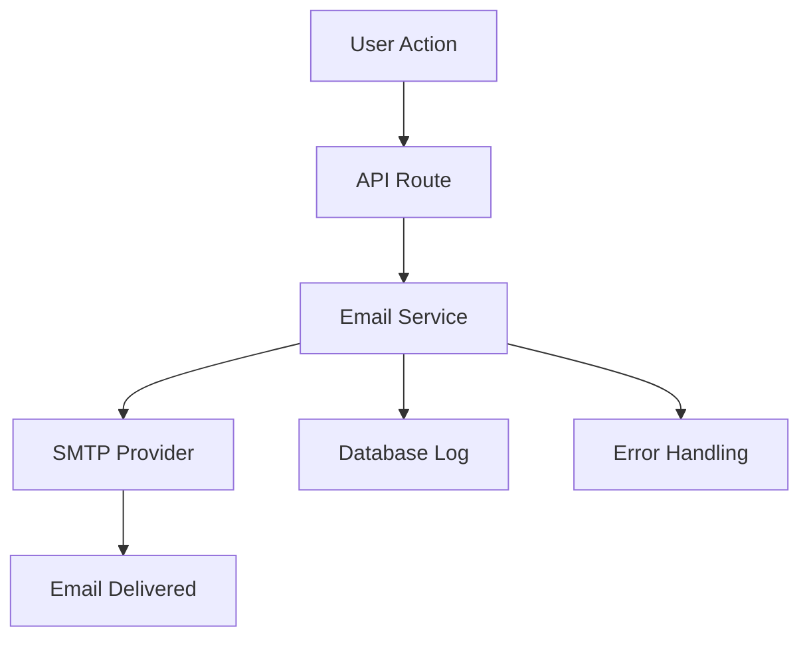
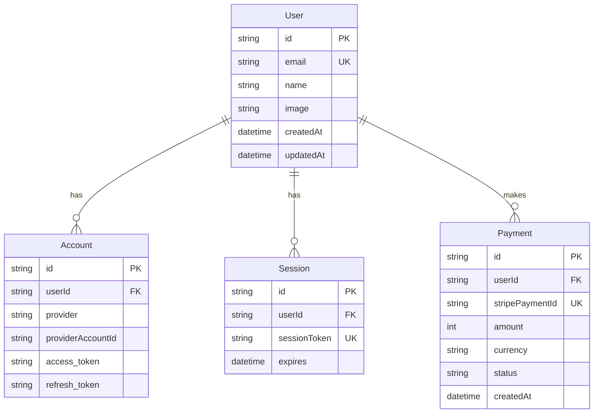

# NextStack Pro Architecture Guide

This document provides a comprehensive overview of the application architecture, explaining how all components work together to create a complete fullstack application.

## 🏗️ System Architecture

### High-Level Overview

```
┌─────────────────┐    ┌─────────────────┐    ┌─────────────────┐
│   Frontend      │    │   Backend       │    │   External      │
│   (Next.js)     │    │   (API Routes)  │    │   Services      │
├─────────────────┤    ├─────────────────┤    ├─────────────────┤
│ • React Pages   │◄──►│ • Auth API      │◄──►│ • Google OAuth  │
│ • Components    │    │ • Stripe API    │    │ • Stripe        │
│ • State Mgmt    │    │ • Email API     │    │ • SMTP Provider │
│ • UI/UX         │    │ • Database      │    │ • Database      │
└─────────────────┘    └─────────────────┘    └─────────────────┘
```

### Data Flow Architecture

```
User Action → Frontend Component → API Route → Database/External Service → Response → UI Update
```

## 🔐 Authentication Flow

### Google OAuth Implementation



### Key Files and Their Roles

1. **`src/lib/auth.ts`** - NextAuth.js configuration
2. **`src/app/api/auth/[...nextauth]/route.ts`** - Authentication API handler
3. **`src/components/auth/google-signin.tsx`** - Sign-in UI component
4. **`src/app/auth/signin/page.tsx`** - Custom sign-in page

## 💳 Payment Processing Flow

### Stripe Integration Architecture



### Payment Components

1. **`src/lib/stripe.ts`** - Stripe client configuration
2. **`src/app/api/stripe/checkout/route.ts`** - Checkout session creation
3. **`src/app/api/stripe/webhook/route.ts`** - Webhook event handling
4. **`src/components/stripe/checkout-button.tsx`** - Payment UI component

## 📧 Email System Architecture

### Email Flow



### Email Components

1. **`src/lib/email.ts`** - Email service functions
2. **`src/app/api/send-email/route.ts`** - Email API endpoint
3. **Email Templates** - HTML email templates with inline CSS

## 🗄️ Database Architecture

### Entity Relationship Diagram



### Database Operations

1. **User Management** - Authentication and profile data
2. **Session Handling** - JWT token management
3. **Payment Records** - Transaction history and status
4. **Audit Logging** - System events and user actions

## 🎨 Frontend Architecture

### Component Hierarchy

```
App Layout (layout.tsx)
├── Providers (providers.tsx)
│   ├── NextAuth SessionProvider
│   ├── Theme Provider
│   └── Toast Provider
├── Header
│   ├── Navigation
│   ├── User Menu
│   └── Theme Toggle
├── Main Content (page.tsx)
│   ├── Tutorial Steps
│   ├── Interactive Demos
│   └── Progress Tracking
└── Footer
```

### State Management

- **NextAuth Session** - User authentication state
- **Local Storage** - Tutorial progress and preferences
- **React State** - Component-level state management
- **Context API** - Theme and global state

## 🔧 API Architecture

### API Route Structure

```
/api/
├── auth/
│   └── [...nextauth]/
│       └── route.ts          # NextAuth.js handler
├── stripe/
│   ├── checkout/
│   │   └── route.ts          # Create checkout session
│   └── webhook/
│       └── route.ts          # Handle Stripe webhooks
├── send-email/
│   └── route.ts              # Send emails
└── tutorial/
    └── progress/
        └── route.ts          # Tutorial progress tracking
```

### API Design Principles

1. **RESTful Design** - Standard HTTP methods and status codes
2. **Authentication** - Session-based auth for protected routes
3. **Error Handling** - Consistent error responses
4. **Validation** - Input validation and sanitization
5. **Rate Limiting** - Protection against abuse

## 🚀 Deployment Architecture

### Production Environment

```
┌─────────────────┐    ┌─────────────────┐    ┌─────────────────┐
│   Vercel        │    │   Database      │    │   External      │
│   (Frontend +   │    │   (PostgreSQL)  │    │   Services      │
│    API Routes)  │    │                 │    │                 │
├─────────────────┤    ├─────────────────┤    ├─────────────────┤
│ • Static Assets │    │ • User Data     │    │ • Google OAuth  │
│ • Server Funcs  │    │ • Sessions      │    │ • Stripe API    │
│ • Edge Runtime  │    │ • Payments      │    │ • Email SMTP    │
│ • CDN           │    │ • Audit Logs    │    │ • Monitoring    │
└─────────────────┘    └─────────────────┘    └─────────────────┘
```

### Deployment Components

1. **Vercel Platform** - Hosting and serverless functions
2. **PostgreSQL** - Production database
3. **Environment Variables** - Secure configuration management
4. **CDN** - Global content delivery
5. **Monitoring** - Error tracking and performance metrics

## 🔒 Security Architecture

### Security Layers

1. **Authentication** - OAuth 2.0 with Google
2. **Authorization** - Session-based access control
3. **Data Protection** - Encrypted data transmission
4. **Input Validation** - Server-side validation
5. **Rate Limiting** - API abuse prevention
6. **CSRF Protection** - Built-in NextAuth.js protection

### Security Best Practices

- Environment variable protection
- Secure cookie configuration
- HTTPS enforcement
- Content Security Policy (CSP)
- Regular dependency updates
- Webhook signature verification

## 📊 Monitoring and Observability

### Monitoring Stack

1. **Application Monitoring** - Error tracking and performance
2. **Database Monitoring** - Query performance and connections
3. **API Monitoring** - Response times and error rates
4. **User Analytics** - Usage patterns and behavior
5. **Infrastructure Monitoring** - Server health and resources

### Key Metrics

- Authentication success/failure rates
- Payment processing metrics
- Email delivery rates
- API response times
- Database query performance
- User engagement metrics

This architecture provides a solid foundation for building scalable, secure, and maintainable fullstack applications with modern web technologies.
