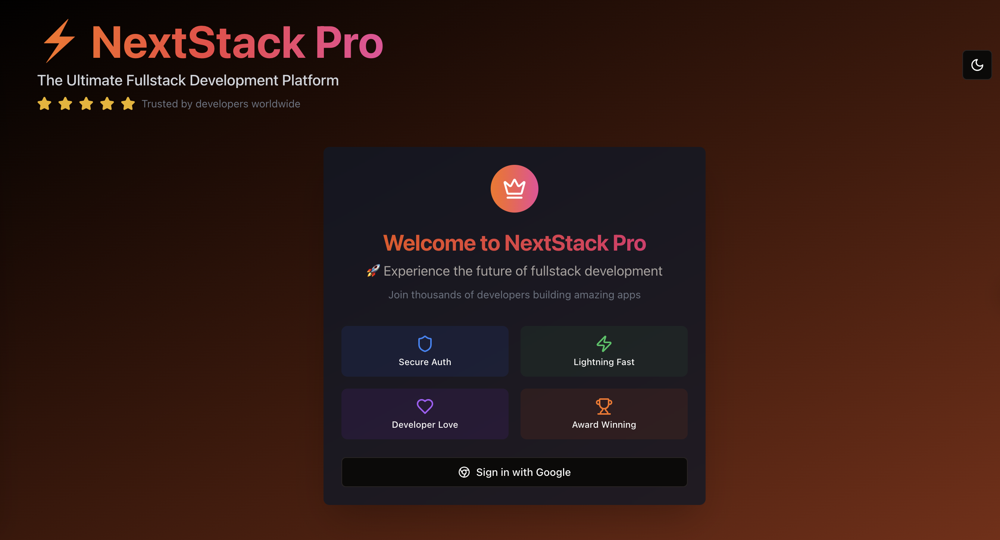

# 🚀 NextStack Pro - Complete Fullstack Tutorial

A comprehensive tutorial application demonstrating modern fullstack development with Next.js, featuring Google OAuth authentication, Stripe payments, email automation, and database management.

## 🌐 Live Demo
**[🚀 Visit Stripe/Google/Email Full-stack tutorial](https://stripe-google-email-fullstack.vercel.app/)**



## 🎯 What You'll Learn

This tutorial teaches you to build a production-ready fullstack application with:

- **🔐 Authentication**: Google OAuth with NextAuth.js
- **💳 Payments**: Stripe integration with webhooks
- **📧 Email System**: Automated emails with Nodemailer
- **🗄️ Database**: Prisma ORM with SQLite
- **🎨 Modern UI**: Tailwind CSS with shadcn/ui components
- **⚡ Performance**: Next.js App Router with TypeScript

## 🏗️ Architecture Overview

```
├── src/
│   ├── app/                    # Next.js App Router
│   │   ├── api/               # API Routes
│   │   │   ├── auth/          # NextAuth.js endpoints
│   │   │   ├── stripe/        # Payment processing
│   │   │   └── send-email/    # Email automation
│   │   ├── payment/           # Payment success/cancel pages
│   │   ├── layout.tsx         # Root layout with providers
│   │   └── page.tsx           # Main dashboard
│   ├── components/            # Reusable UI components
│   │   ├── auth/             # Authentication components
│   │   ├── stripe/           # Payment components
│   │   └── ui/               # shadcn/ui components
│   └── lib/                  # Utility libraries
│       ├── auth.ts           # NextAuth configuration
│       ├── email.ts          # Email service
│       └── prisma.ts         # Database client
├── prisma/
│   └── schema.prisma         # Database schema
└── package.json              # Dependencies and scripts
```

## 🚀 Quick Start

### Prerequisites
- Node.js 18+ installed
- Google Cloud Console account
- Stripe account
- Email service (Gmail, SendGrid, etc.)

### 1. Clone and Install
```bash
git clone https://github.com/raimonvibe/stripe-google-email-fullstack.git
cd stripe-google-email-fullstack
npm install
```

### 2. Environment Setup
Create a `.env.local` file in the root directory:

```env
# Database
DATABASE_URL="file:./dev.db"

# NextAuth.js
NEXTAUTH_URL="http://localhost:3000"
NEXTAUTH_SECRET="your-secret-key-here"

# Google OAuth (Get from Google Cloud Console)
GOOGLE_CLIENT_ID="your-google-client-id"
GOOGLE_CLIENT_SECRET="your-google-client-secret"

# Stripe (Get from Stripe Dashboard)
STRIPE_SECRET_KEY="sk_test_your-stripe-secret-key"
STRIPE_WEBHOOK_SECRET="whsec_your-webhook-secret"

# Email Configuration
EMAIL_HOST="smtp.gmail.com"
EMAIL_PORT="587"
EMAIL_SECURE="true"
EMAIL_USER="your-email@gmail.com"
EMAIL_PASS="your-app-password"
EMAIL_FROM="your-email@gmail.com"
```

### 3. Database Setup
```bash
npx prisma generate
npx prisma db push
```

### 4. Run Development Server
```bash
npm run dev
```

Visit [http://localhost:3000](http://localhost:3000) to see your application!

## 📚 Tutorial Sections

### Section 1: Authentication with Google OAuth
Learn how to implement secure authentication using NextAuth.js and Google OAuth.

**Key Files:**
- `src/lib/auth.ts` - NextAuth configuration
- `src/components/auth/google-signin.tsx` - Sign-in component

**What You'll Learn:**
- Setting up Google OAuth in Google Cloud Console
- Configuring NextAuth.js with Prisma adapter
- Managing user sessions and JWT tokens
- Protecting API routes and pages

### Section 2: Payment Processing with Stripe
Implement secure payment processing with Stripe Checkout and webhooks.

**Key Files:**
- `src/app/api/stripe/checkout/route.ts` - Checkout session creation
- `src/app/api/stripe/webhook/route.ts` - Webhook handling

**What You'll Learn:**
- Creating Stripe Checkout sessions
- Handling payment webhooks securely
- Storing payment records in database
- Error handling and validation

### Section 3: Email Automation
Build an email system for user notifications and marketing.

**Key Files:**
- `src/lib/email.ts` - Email service
- `src/app/api/send-email/route.ts` - Email API

**What You'll Learn:**
- Configuring SMTP with Nodemailer
- Creating HTML email templates
- Sending welcome and confirmation emails
- Email security best practices

### Section 4: Database Management with Prisma
Learn modern database management with Prisma ORM.

**Key Files:**
- `prisma/schema.prisma` - Database schema
- `src/lib/prisma.ts` - Database client

**What You'll Learn:**
- Designing database schemas
- Type-safe database queries
- Handling relationships and migrations
- Database best practices

### Section 5: Modern UI Development
Build beautiful, responsive interfaces with Tailwind CSS and shadcn/ui.

**Key Files:**
- `src/app/page.tsx` - Main dashboard
- `src/components/ui/` - UI components

**What You'll Learn:**
- Component-driven development
- Responsive design patterns
- Dark mode implementation
- Accessibility best practices

## 🔧 Configuration Guides

### Google OAuth Setup
1. Go to [Google Cloud Console](https://console.cloud.google.com/)
2. Create a new project or select existing
3. Enable Google+ API
4. Create OAuth 2.0 credentials
5. Add authorized redirect URIs: `http://localhost:3000/api/auth/callback/google`

### Stripe Setup
1. Create account at [Stripe](https://stripe.com)
2. Get API keys from Dashboard
3. Set up webhook endpoint: `http://localhost:3000/api/stripe/webhook`
4. Configure webhook events: `checkout.session.completed`, `payment_intent.succeeded`

### Email Setup (Gmail)
1. Enable 2-factor authentication
2. Generate app-specific password
3. Use app password in EMAIL_PASS environment variable

## 🧪 Testing Your Application

### Authentication Flow
1. Click "Sign in with Google"
2. Complete OAuth flow
3. Verify user data in dashboard

### Payment Flow
1. Click "Unlock Premium Features"
2. Complete test payment (use `4242 4242 4242 4242`)
3. Verify payment success page

### Email System
1. Click "Send Welcome" button
2. Check email inbox for welcome message
3. Verify email delivery logs

## 🚀 Deployment

### Vercel Deployment
```bash
npm run build
npx vercel --prod
```

### Environment Variables for Production
Update your production environment variables:
- Change NEXTAUTH_URL to your domain
- Use production Stripe keys
- Configure production email service

## 📖 Additional Resources

- [Next.js Documentation](https://nextjs.org/docs)
- [NextAuth.js Guide](https://next-auth.js.org/)
- [Stripe Documentation](https://stripe.com/docs)
- [Prisma Documentation](https://www.prisma.io/docs)
- [Tailwind CSS](https://tailwindcss.com/docs)

## 🤝 Contributing

This is an educational project. Feel free to:
- Report issues
- Suggest improvements
- Add new features
- Share your learning experience

## 📄 License

MIT License - feel free to use this code for learning and building your own projects!
